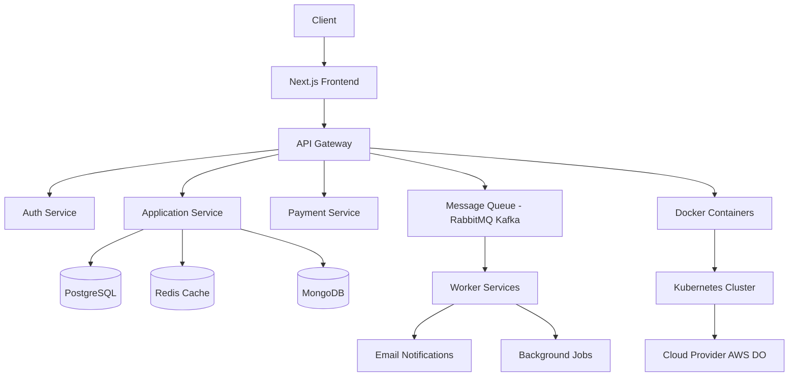
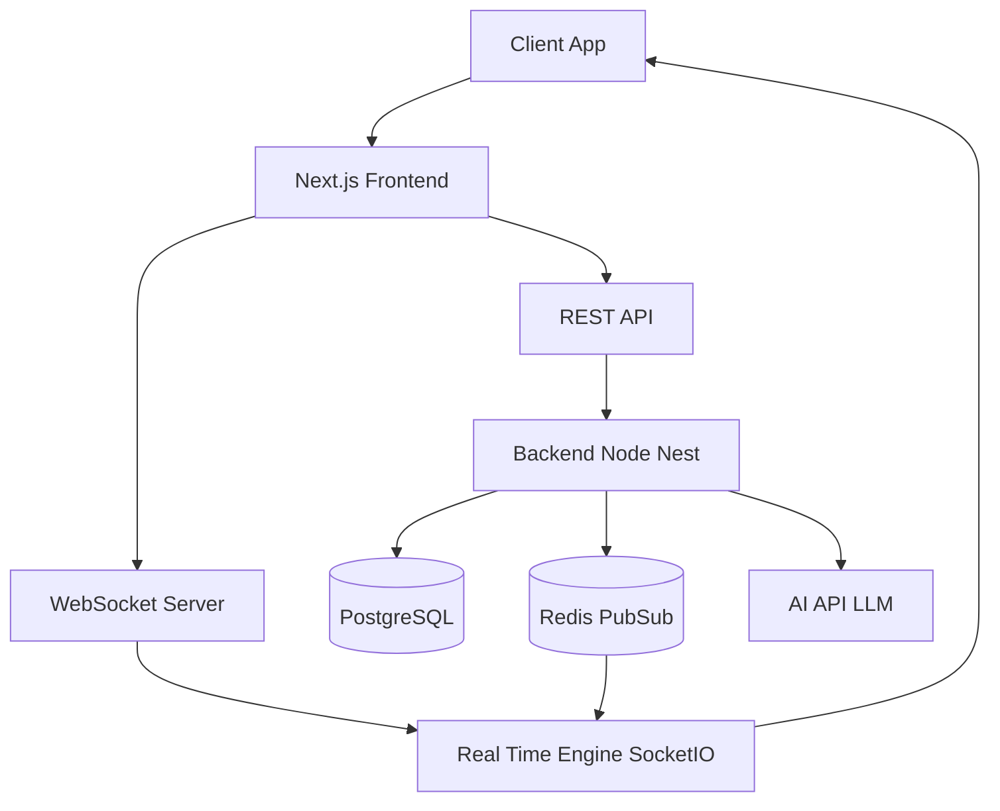
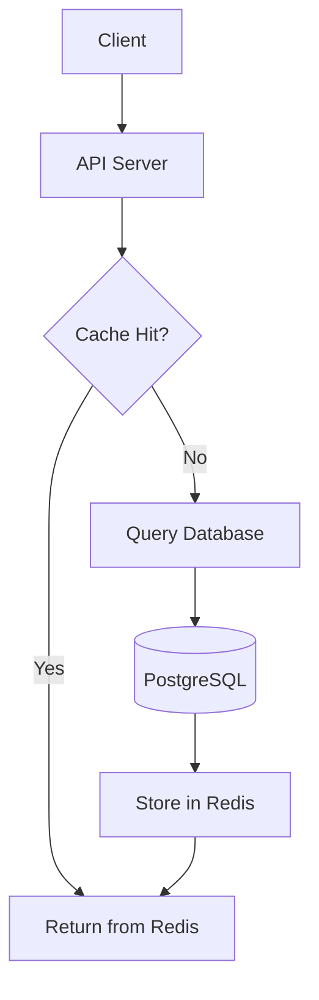

<h1 align="center">Hi 👋, I'm MD Rakibul Islam Rakib</h1>

  
  
  
  

<h3 align="center">
Full-Stack Engineer • DevOps Engineer • Linux System Administrator  
from Bangladesh 🇧🇩
</h3>

---

## 🚀 About Me

I’m a **Full-Stack Developer & DevOps Engineer with 5+ years of experience** building scalable applications and managing production infrastructure.

I specialize in:
- High-performance web applications (React / Next.js)
- Backend systems (Node.js, Express.js, Nest.js, APIs)
- DevOps & cloud infrastructure (Docker, Kubernetes, AWS)
- Linux server management & security

💡 I build **end-to-end systems** — from UI → backend → deployment → scaling.

---

## 🔧 Tech Stack

### 🖥️ Frontend
- React.js, Next.js, TypeScript, JavaScript  
- Redux Toolkit, Zustand, RTK Query  
- Tailwind CSS, ShadCN UI, MUI, Flowbite  
- Responsive Design (Figma → Production)

### ⚙️ Backend
- Node.js, Express.js, Nest.js  
- REST APIs, Prisma ORM  
- PostgreSQL, MongoDB  
- Auth (JWT, NextAuth), RBAC  
- WebSockets (Socket.io)

### ☁️ DevOps & Infrastructure
- Linux (Ubuntu, CentOS, Red Hat)  
- Docker, Kubernetes  
- AWS (EC2, EKS), Azure, GCP, DigitalOcean  
- CI/CD Pipelines (GitHub Actions, GitLab CI)  
- Nginx, Server Hardening, Monitoring  

### 🤖 AI & Integrations
- AI API integrations (LLMs, STT, TTS)  
- Chatbots & AI features  
- Image generation & automation tools  

---

## 💼 Professional Experience

### **Full Stack Engineer — NETME**  
📅 Jul 2024 – Apr 2026  
- Built features for a multi-region social platform  
- Developed UI, backend APIs, authentication & event systems  
- Designed DB schemas & handled deployments  
- Worked on production environment: **dev.netme.eu**

---

### **Full-Stack Developer — NexStack**  
📅 Mar 2024 – Jul 2024  
- Delivered scalable SaaS applications using Next.js & Node.js  
- Collaborated with cross-functional teams  
- Managed production deployments using Docker & cloud infra  

---

### **Linux System Administrator — StudiaNova**  
📅 Aug 2020 – Present  
- Managed production servers for virtual school platform  
- Implemented **security hardening, backups & monitoring**  
- Ensured uptime and performance optimization  
- Solved real-time server & network issues  

---

## 🧠 Key Projects

### 🔹 AI Platform – Miragic.ai
- Built AI-powered features: image generation, try-on, STT/TTS  
- Integrated multiple AI APIs  
- Optimized frontend performance  

---

### 🔹 Social Platform – NETME
- Real-time user connection platform  
- Authentication, profiles, event systems  
- Production deployment support  

---

### 🔹 AI Chat App – TalkAI
- Real-time chatbot platform  
- Improved state management & performance  
- Integrated AI APIs  

---

### 🔹 Personal Platform (Portfolio + Marketplace)
🌐 https://www.rakibulinux.com/

- Portfolio + service marketplace system  
- Stripe payments & user dashboard  
- Full admin panel  

**Tech:** Next.js, PostgreSQL, Prisma, Stripe, JWT  

---

## 🏆 Leadership

### Team Lead — Blogging Platform
- Led a team of 6 developers  
- Built full-stack platform with premium subscriptions  
- Integrated payments (SSLCOMMERZ)  

---

## 🧠 How I Build Systems

- Design for **scalability first** (stateless services, horizontal scaling)  
- Use **caching layers (Redis)** to reduce DB load  
- Implement **queue systems** for async processing  
- Secure systems with **RBAC + JWT + server hardening**  
- Optimize performance with **profiling & monitoring**  
- Automate everything via **CI/CD pipelines**  

## 🧩 Engineering Strengths
- System Design & Architecture
- Performance Optimization
- Backend Scalability
- DevOps & Infrastructure Automation
- Debugging Complex Production Issues

---

## 🏗️ System Design Examples

### ✔️ 1. Scalable SaaS Architecture

### ✔️ 2. Real-Time Chat System (Fixed)

### ✔️ 3. API + Cache (Safe Version)

---
## 📊 GitHub Insights

  
  

  

---

## 🌐 Connect With Me

- 🌍 Portfolio: https://www.rakibulinux.com  
- 💼 LinkedIn: https://www.linkedin.com/in/rakibulinux/  
- 🐦 Twitter/X: https://twitter.com/rakibulinux  
- 🧑‍💻 GitHub: https://github.com/rakibulinux  
- 📧 Email: rakibulinux@gmail.com  

---

## 💡 What I Bring

- End-to-end system development (Frontend → Backend → DevOps)  
- Production-grade deployment experience  
- Strong debugging & problem-solving skills  
- Experience with global clients  

---

## ☕ Support Me

---

<h3 align="center">Thanks for visiting 👋</h3>
